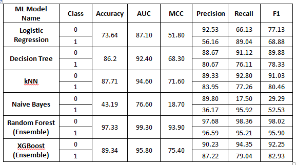

# Hotel Reservation Cancellation Prediction

## Problem Statement
Hotels often face financial losses due to booking cancellations. When a booking is canceled, the hotel may not be able to resell the room, leading to revenue loss.

The goal of this project is to predict whether a hotel booking will be **cancelled or not** using historical booking data. This helps hotels:
- Identify bookings likely to be canceled
- Plan room availability effectively
- Improve pricing and management decisions

This is a **binary classification problem**:
- **0** – Booking Not Canceled  
- **1** – Booking Canceled

---

## Dataset Description
The dataset contains historical hotel reservation records including customer details, booking information, and stay-related features.

### Target Variable
- **0** - Booking Not Canceled  
- **1** - Booking Canceled

### Key Features
**Customer & Booking Details**
- no_of_adults  
- no_of_children  
- repeated_guest  
- lead_time  
- no_of_previous_bookings_not_canceled  

**Stay Information**
- no_of_weekend_nights  
- no_of_week_nights  
- required_car_parking_space  
- no_of_special_requests  

**Pricing**
- avg_price_per_room  

**Time-based Features**
- Arrival month (one-hot encoded as arrival_month_1, arrival_month_2, …)

---

## Data Preprocessing
- Categorical features were converted using **One-Hot Encoding**
- Original dataset `Hotel Reservations.csv` was saved as `Hotel Reservations_data_features.csv` after encoding
- Numerical features were scaled using **MinMaxScaler** where required
- Dataset was split into **80% training** and **20% testing**
- Class imbalance was handled using **stratified sampling**

---

## Models Used
Multiple machine learning models were implemented and evaluated:

1. **Logistic Regression**
   - Baseline linear model
   - Interpretable coefficients
   - Works well with scaled data

2. **Decision Tree Classifier**
   - Captures non-linear relationships
   - Easy to interpret
   - No scaling required

3. **K-Nearest Neighbors (KNN)**
   - Distance-based model
   - Sensitive to feature scaling
   - Good for local decision boundaries

4. **Naive Bayes**
   - Probabilistic model based on Bayes’ theorem
   - Fast and efficient
   - Assumes feature independence

5. **Random Forest (Ensemble)**
   - Ensemble of decision trees
   - Reduces overfitting
   - Highly accurate and robust

6. **XGBoost (Ensemble)**
   - Gradient boosting model
   - Handles complex patterns
   - High predictive performance

---

## Model Evaluation Metrics

All models comparison table with the evaluation metrics calculated as below.

---

## Model Performance Summary

| Model | Observation |
|------|------------|
| Logistic Regression | Performs moderately well but predicts cancellations with low precision |
| Decision Tree | More balanced performance than Logistic Regression |
| kNN | Good accuracy and balanced performance for both classes |
| Naive Bayes | Performs poorly and is not suitable |
| Random Forest | Best performance with very high accuracy and F1-score |
| XGBoost | Very strong performance, second best after Random Forest |

---

## Model Performance Evaluation Using Streamlit Application
The trained machine learning models can be evaluated using the Streamlit web application. By accessing the link below, users can view and compare model performance metrics such as Accuracy, Precision, Recall, and F1-score.

 **Streamlit App:**  
https://mlmodels-prediction.streamlit.app/

The complete source code, trained models, and documentation are available in the GitHub repository:

**GitHub Repository:**  
https://github.com/jaipal1983/ML_Models/tree/master/Project

---

## Conclusion
Among all the models, ensemble methods such as **Random Forest** and **XGBoost** outperform individual models. Random Forest shows the best overall performance with the highest accuracy, AUC, MCC, and F1-scores for both classes. Therefore, **Random Forest is the most suitable model for predicting hotel booking cancellations**.

